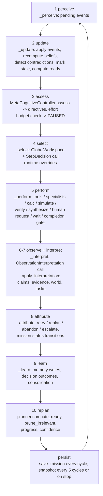

# Architecture

`cogos` separates two things that are usually tangled together in an agent: the **control loop**
(deterministic Python that owns state, ordering, retries, persistence and completion) and
**cognition** (bounded, structured-output calls to a resident frontier model). Everything the model
says is validated against a pydantic contract, and the runtime, not the model, decides what counts
as done.

## Module map

| Package | Key symbols | Calls a model? |
|---|---|---|
| `cogos/config.py` | `CogosConfig`, `ExecutiveConfig`, `GovernanceConfig`, `BudgetConfig`, `MemoryConfig`, `DEFAULT_EXECUTIVE_MODEL`, `load_config` | no |
| `cogos/schemas/` | `MissionState` (aggregate root), `Task`, `Claim`, `Evidence`, `Hypothesis`, `Contradiction`, `WorldModel`, `MemoryRecord`, `Decision`, `Event`, `TraceEvent`, `ToolSpec`/`ToolCall`/`ToolResult`, all cognition contracts | no |
| `cogos/persistence/` | `StateStore`, `StoreConflict`, `migrations.MIGRATIONS` | no |
| `cogos/adapters/` | `ExecutiveModel` protocol, `CognitionRequest`/`CognitionResponse`, `ClaudeCodeExecutive`, `AnthropicApiExecutive`, `HeuristicExecutive`, `ScriptedExecutive`, `build_adapter`, `schema_utils.schema_for` | the adapters are the only model boundary |
| `cogos/prompts.py` | `CONSTITUTION` and the per-kind system prompts in `PROMPTS` (`compile`, `select`, `interpret`, `specialist`, `challenge`, `verify`, `synthesize`, `replan`) | no |
| `cogos/mission/compiler.py` | `MissionCompiler`, `gather_repo_context` | via adapter (`compile`) |
| `cogos/executive/loop.py` | `Executive`, `OperationOutcome`, `CycleResult`, `EXECUTIVE_KINDS` | via adapter (`select`, `interpret`, `synthesize`, `replan`, `challenge`) |
| `cogos/executive/controller.py` | `MetaCognitiveController`, `Assessment` | no |
| `cogos/planner/dag.py` | `Planner`, `RetryDecision` | no |
| `cogos/workspace/global_workspace.py` | `GlobalWorkspace`, `WorkspaceView` | no |
| `cogos/beliefs/graph.py` | `BeliefGraph`, `TournamentResult` | no |
| `cogos/world_model/manager.py` | `WorldModelManager` | no |
| `cogos/memory/manager.py` | `MemoryManager` | no |
| `cogos/agent_foundry/foundry.py` | `AgentFoundry`, `SpecialistRun`, `SpawnDecision`, `DisagreementReport`, `CLAUDE_TOOL_MAP`, `ROLE_GUIDANCE` | via adapter (`specialist`, `challenge`) |
| `cogos/tools/fabric.py`, `safe_calc.py` | `ToolFabric`, `ToolContext`, `build_default_fabric`, `safe_eval` | no |
| `cogos/governance/firewall.py`, `immune.py` | `CapabilityFirewall`, `classify_shell_command`, `scan_for_injection`, `wrap_untrusted`, `source_trust` | no |
| `cogos/verification/engine.py` | `VerificationEngine`, `VerificationResult`, `mission_completion_check` | no |
| `cogos/simulation/engine.py` | `simulate`, `expected_value_of_information`, `Scenario` | no |
| `cogos/observability/` | `Tracer`, `DecisionJournal`, `ResourceLedger`, `CalibrationTracker` | no |
| `cogos/events/` | `EventBus`, `filter_matches`, poll-based sources | no |
| `cogos/skills/` | `SkillCompiler`, `SkillDoc`, `discover`, `relevant_skills` | no (the evaluation runner is supplied by the caller) |
| `cogos/evaluation/` | `run_suite`, `aggregate_metrics`, `ACCEPTANCE`, `ADVERSARIAL`, `run_demo` | scripted adapter only |
| `cogos/runtime.py`, `cogos/cli.py` | `Runtime`, `BootReport`, `boot_summary`, `main` | wiring only |

## The executive cycle

`Executive.run` loads a mission, moves `DRAFT` to `ACTIVE`, re-applies human grants to the
firewall, then loops `Executive.cycle` while the mission is `ACTIVE` and under the cycle limit.
Each cycle is one pass through the phases below; after each cycle `_persist` writes the mission
back to SQLite.

Phase details, as implemented in `cogos/executive/loop.py`:

1. **perceive** - `EventBus.pending_for(mission_id)`; each event is traced as `event`.
2. **update** - `WorldModelManager.advance_time`; trusted `human_input` events answer
   `HumanRequest`s, add grants, corrections and new facts; `new_evidence` events become
   `Evidence` with `UNTRUSTED_EXTERNAL` provenance; subscription `affects` maps flag claims for
   re-verification, reopen unknowns and reset blocked/failed tasks; answered requests resolve
   `BlockedOperation`s; then `BeliefGraph.recompute`, `detect_contradictions`,
   `mark_stale(max_age_days=90)`, `Planner.compute_ready`, and
   `HumanRequest.independent_work_remaining` is recomputed for every unanswered request.
3. **assess** - `ResourceLedger.over_budget` (breach pauses the mission and stops the run);
   `_verification_pending` (done tasks with commands/artifacts/research but no
   `verification_ids`); `_falsification_target` from `BeliefGraph.falsification_targets`;
   `MetaCognitiveController.assess` produces an `Assessment` with directives such as
   `must_verify`, `must_falsify`, `should_challenge`, `change_strategy`, `terminate_branch`,
   `isolate_blocked`, `prioritise_unknowns`, `tool_unreliable`, `diminishing_returns`, `escalate`,
   `stop`. `terminate_branch` cancels dependents of permanently failed tasks.
4. **select** - builds the `GlobalWorkspace` digest (bounded by `workspace_max_chars`), quarantines
   injected memories, attaches structured `metadata`, and requests a `StepDecision`. Two hard
   overrides apply regardless of what the model said: `complete_mission` with verification pending
   becomes `verify`, and an unknown `task_id` is cleared. A failed or invalid response falls back
   to `_fallback_select` (deterministic). `ExecutiveUnavailable` blocks the mission (see
   MODEL_POLICY.md). Consequential decisions are journaled.
5. **perform** - dispatch on `OperationKind` (see table below). The task is marked `ACTIVE` and its
   `attempts` incremented first.
6. **observe / interpret** - `_interpret` short-circuits for runtime-only operations
   (`complete_mission`, `wait_for_external_event`, `request_human_authorization`, `synthesize`,
   `verify`); otherwise it asks for an `ObservationInterpretation` with external content passed as
   `UntrustedBlock`s. `_apply_interpretation` writes claims, evidence, claim updates, contradictions,
   hypothesis updates, world/causal updates, resolved and new unknowns, lessons, task status, new
   tasks and specialist artifacts into state, then recomputes beliefs. `criteria_satisfied` is only
   honoured for criteria that already have `verification_ids`.
7. **attribute** - `_attribute` runs `Planner.retry_decision` for failed tasks, writes a `FAILURE`
   memory, and performs the mission-level transitions to `COMPLETE`, `BLOCKED_EXTERNAL`, `PAUSED`
   or `FAILED` (see AUTONOMY.md).
8. **learn** - `_learn` writes episodic/semantic/procedural/causal memories, resolves consequential
   decisions on completion, and runs `MemoryManager.consolidate` every
   `memory.consolidation_interval_cycles`.
9. **replan** - `compute_ready`, `prune_irrelevant`, `progress()`, `_mission_confidence`, unknown
   attempt counters.
10. **persist** - `_persist` saves with event kind `cycle`; `_checkpoint` exports a snapshot every
    5 cycles, on stop, and once more (`final`) when `run` exits.

### Operation dispatch in `_perform`

| `OperationKind` | What the runtime does |
|---|---|
| `inspect_files`, `execute_code`, `run_experiment`, `use_external_tool`, `execute_action`, `search`, `retrieve_memory` | Executes `decision.tool_calls` (or calls derived from task parameters) through `ToolFabric`; `web_search` has no local substrate and is delegated to a `researcher` specialist; untrusted outputs are wrapped as `UntrustedBlock`s. |
| `calculate` | `calculate` tool -> `safe_eval` |
| `simulate` | `simulation.simulate` on `decision.simulation_json`, task `scenario`, or `_scenario_from_state` |
| `direct_reasoning` | records `reasoning_output` (no tool) |
| `instantiate_specialist`, `parallel_workstreams`, `falsify` | `AgentFoundry.should_spawn` then `run`/`run_parallel`; independent specialists trigger the challenge protocol (`_extract_disagreements`) |
| `verify` | `VerificationEngine` (code, research, task/artifacts, or criteria pass) - deterministic |
| `synthesize` | `Synthesis` call; unverified `criteria_assessment.satisfied` flags are stripped by the runtime |
| `request_human_authorization` | appends a `HumanRequest` |
| `wait_for_external_event` | subscribes the mission to the event kind |
| `complete_mission` | `mission_completion_check` gate; only a `PASSED` gate completes |

## Cognition call sites and contracts

Every model call is a `CognitionRequest(kind, system_prompt, prompt, schema_name, output_schema,
model, untrusted, tools, ...)` and returns a `CognitionResponse(ok, parsed, models_used,
residency_ok, error_kind, ...)`. `output_schema` is produced by `schema_utils.schema_for`, which
strips numeric/string bounds and marks every property required (provider structured-output rules);
pydantic re-applies defaults and the runtime clamps values after parsing.

| kind | Call site | Contract (`cogos/schemas/cognition.py` unless noted) | On failure |
|---|---|---|---|
| `compile` | `MissionCompiler.compile` | `MissionCompilation` (criteria, constraints, facts, assumptions, unknowns, hypotheses, goals, task DAG, risks, required artifacts/tests, human requests) | `default_compilation` (deterministic plan by mission kind); also used when the model returns zero tasks |
| `select` | `Executive._select` | `StepDecision` (operation, task_id, rationale, tool_calls, specialists, reasoning_output, human_request, calculation, simulation_json, wait_for_event_kind, consequential) | `_fallback_select` |
| `interpret` | `Executive._interpret` | `ObservationInterpretation` (new evidence/claims, claim updates, contradictions, task updates, new tasks, resolved/new unknowns, world/causal updates, lessons, hypothesis updates, criteria_satisfied, injection_detected) | `HeuristicExecutive._interpret` |
| `specialist` | `AgentFoundry.run` | `SpecialistReport` (conclusion, findings with evidence, artifacts, unresolved, blocked) | run recorded as failed; transient failures count as retries |
| `challenge` | `Executive._extract_disagreements`, `AgentFoundry.independent_challenge` | `DisagreementReport` (`cogos/agent_foundry/foundry.py`, list of `Disagreement`) | challenge skipped |
| `synthesize` | `Executive._synthesize` | `Synthesis` (conclusion, decision, rationale, criteria_assessment, remaining uncertainties, mission_status, blocked_by) | synthesis absent; task fails |
| `replan` | `Executive._replan`, `Executive._replan_task` | `Replan` (new_tasks, give_up, blocked_by, what_would_unblock) | `_heuristic_replan` / `_heuristic_task_replan` |
| `verify` | none in the loop | `VerificationJudgment` and `PROMPTS["verify"]` exist and `HeuristicExecutive._verify` implements the kind, but `Executive` never issues a `verify` cognition request: verification is deterministic (`VerificationEngine`) | n/a |

`EXECUTIVE_KINDS = {"compile", "select", "interpret", "synthesize", "replan", "challenge", "verify"}`
is the set for which `Executive._cognition` enforces model residency; `specialist` is checked but
not enforced (see MODEL_POLICY.md).

## Why the loop is Python-owned

From `.plans/cognitive-os-implementation.md`, decision 2: "a loop that lives inside one LLM context
cannot survive context loss; a loop that lives in Python can." Consequences in code:

* `MissionState` is the source of truth and is saved after every cycle; conversation history is
  never persisted or replayed.
* The model is asked only for typed cognition; the runtime decides ordering (`Planner`), retries
  (`retry_decision`), verification (`VerificationEngine`), completion (`mission_completion_check`),
  memory writes (`_learn`) and budget (`ResourceLedger`).
* Every model call has a deterministic fallback or a recorded failure, so the loop keeps making
  progress or stops honestly.
* Tests and evaluations drive the identical code path with `ScriptedExecutive`.

## Adapters

| Adapter | Class | Mechanism | Notes |
|---|---|---|---|
| `claude_code` (default) | `ClaudeCodeExecutive` | `claude -p --output-format json --json-schema ... --model ...` subprocess | Reads `structured_output`, `usage`, `modelUsage`, `permission_denials`; retries transient errors with exponential backoff; the only adapter that can run tool-using specialists |
| `anthropic_api` | `AnthropicApiExecutive` | `anthropic.Anthropic().messages.create(..., output_config={"format": {"type": "json_schema", ...}})` | Lazy import; requires `ANTHROPIC_API_KEY`; reasoning-only (no tools) |
| `scripted` | `HeuristicExecutive` / `ScriptedExecutive` | Rule-based policies over request `metadata`; `ScriptedExecutive` lets tests inject responses per kind and falls back to the heuristics | Used by `demo`, `eval`, `tests/cogos` |

`build_adapter(name, **kwargs)` selects by name; `Runtime._adapter_kwargs` maps `ExecutiveConfig`
onto constructor arguments.

## Deterministic boundaries

The following never consult a model and are therefore replayable and unit-testable in isolation:
`Planner` (DAG, readiness, scoring, cycle breaking, retry policy), `BeliefGraph` (log-odds evidence
aggregation with shared-root discount, contradiction detection, staleness, hypothesis tournament),
`WorldModelManager` (epistemic-status-preserving upserts), `MemoryManager`, `CapabilityFirewall`,
`immune.scan_for_injection`, `VerificationEngine`, `simulation.simulate`, `MetaCognitiveController`,
`GlobalWorkspace`, `CalibrationTracker`, `EventBus`, `SkillCompiler`, and `safe_eval`.

## Deviations from the plan, and why

The plan describes the cycle as `perceive -> update -> select -> act -> verify -> learn`; the loop
docstring expands it to `perceive -> update -> assess -> select -> perform -> observe -> verify ->
attribute -> learn -> persist -> replan`. The implementation differs in these ways:

* **Verify is not a fixed phase.** Verification is an operation the executive selects, but the
  runtime forces it: the `must_verify` directive, the `complete_mission -> verify` override in
  `_select`, and the completion gate. Making it a mandatory per-cycle phase would run tests after
  every reasoning step.
* **Assess was added** (`MetaCognitiveController`) so hard rules (verification, falsification,
  stall detection, budget) are computed from state rather than left to the model.
* **Attribute** is explicit (`_attribute` + `Planner.retry_decision`) because retry vs replan vs
  abandon needs failure signatures and attempt counters that live in state.
* **Compilation has a deterministic fallback** (`default_compilation`), which the plan did not call
  for; it keeps `demo`/`eval` fully offline and keeps missions runnable when the first model call
  fails.
* **The Agent SDK is not used**; the CLI is invoked directly (plan decision 3).
* **Session tooling lives outside the package.** `CLAUDE.md`, `.claude/skills/cogos-*`,
  `.claude/agents/cogos-*.md`, `.claude/hooks/cogos-boot.sh` / `cogos-checkpoint.sh`,
  `.claude/settings.json` and the `make cogos-*` targets exist at the repository root for Claude
  Code sessions; the runtime does not depend on them (it only discovers `.claude/skills/*/SKILL.md`
  as candidate skill descriptions in `Runtime.new_mission`).

## Hermes narrow-waist rationale

AGENTS.md mandates that the Hermes core stay a narrow waist with capability at the edges. `cogos`
follows that literally: the package imports nothing from Hermes (`cogos/` has no `hermes`,
`run_agent` or `cli` imports), has its own entry point (`python -m cogos`), its own config file
(`cogos.yaml`), its own state directory (`.cogos/`, ignored by git) and its own tests. The commit
that introduced it (`7bb7884`) added files only under `cogos/`, `tests/cogos/`, `.plans/` and three
lines to `.gitignore`. Hermes remains usable without cogos, and cogos can be removed by deleting
one directory.
